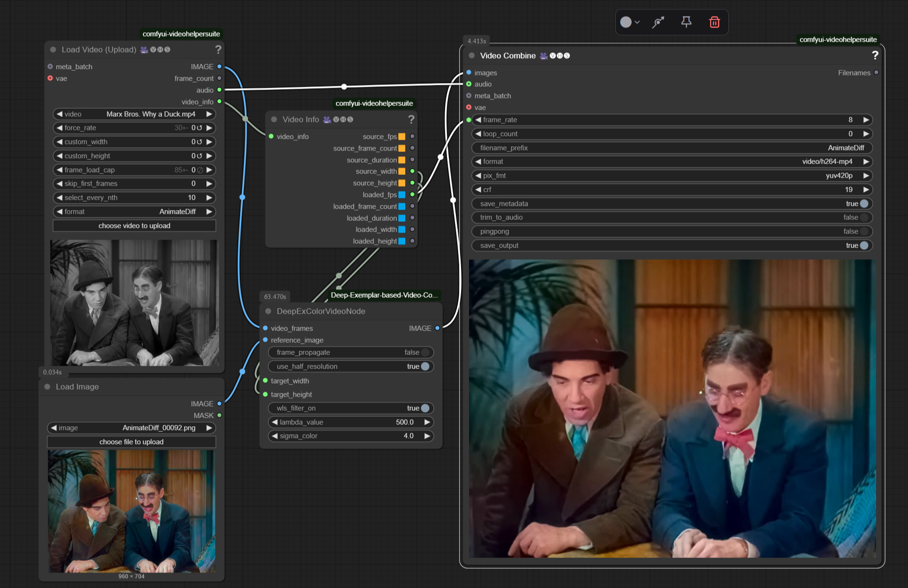

# ComfyUI Deep Exemplar-based Colorization Nodes



This repository provides custom nodes for [ComfyUI](https://github.com/comfyanonymous/ComfyUI) that implement the **Deep Exemplar-based Video Colorization** method (CVPR 2019). It allows you to colorize grayscale images or video frames using a color reference image directly within the ComfyUI workflow.

Based on the original paper and Pytorch implementation:
**[Paper](https://arxiv.org/abs/1906.09909) | [Original Project](https://github.com/zhangmozhe/Deep-Exemplar-based-Video-Colorization) | [Original Pretrained Model](https://github.com/zhangmozhe/Deep-Exemplar-based-Video-Colorization/releases/download/v1.0/colorization_checkpoint.zip)**

**Deep Exemplar-based Video Colorization, CVPR2019**
[Bo Zhang](https://www.microsoft.com/en-us/research/people/zhanbo/)<sup>1,3</sup>, [Mingming He](http://mingminghe.com/)<sup>1,5</sup>, [Jing Liao](https://liaojing.github.io/html/)<sup>2</sup>, [Pedro V. Sander](https://www.cse.ust.hk/~psander/)<sup>1</sup>, [Lu Yuan](https://www.microsoft.com/en-us/research/people/luyuan/)<sup>4</sup>, [Amine Bermak](https://eebermak.home.ece.ust.hk/)<sup>1</sup>, [Dong Chen](https://www.microsoft.com/en-us/research/people/doch/)<sup>3</sup> <br>
<sup>1</sup>HKUST, <sup>2</sup>CityU HK, <sup>3</sup>Microsoft Research Asia, <sup>4</sup>Microsoft Cloud&AI, <sup>5</sup>USC ICT

## Features

*   **DeepExColorImageNode:** Colorizes a single grayscale image using a color reference image.
*   **DeepExColorVideoNode:** Colorizes a batch of grayscale video frames using a color reference image, with optional frame-to-frame propagation.
*   Integration with ComfyUI workflows.
*   Automatic download of pretrained models via ComfyUI Manager or included `install.py`.
*   Adjustable target resolution (internally processed at half-resolution).
*   Optional WLS (Fast Global Smoother) filter post-processing (requires `opencv-contrib-python`).

## Installation

### Using ComfyUI Manager (Recommended)

1.  Install [ComfyUI Manager](https://github.com/ltdrdata/ComfyUI-Manager) if you haven't already.
2.  Open ComfyUI and navigate to the "Manager" menu.
3.  Click "Install Custom Nodes".
4.  Search for "DeepExemplarColorization".
5.  Click "Install".
6.  **Wait for installation to complete.** The manager will run the `install.py` script to download the required model checkpoints (~500MB) into the `ComfyUI/custom_nodes/ComfyUI-Deep-Exemplar-based-Video-Colorization/` directory.
7.  **Install Dependencies:** Ensure `opencv-contrib-python` is installed in your ComfyUI environment if you want to use the WLS filter. The Manager will attempt to install packages listed in `requirements.txt`. You can verify/install manually if needed:
    ```bash
    # In ComfyUI's Python environment:
    # pip install opencv-contrib-python
    ```
8.  **Restart ComfyUI.**

### Manual Installation

1.  Navigate to your ComfyUI `custom_nodes` directory:
    ```bash
    cd ComfyUI/custom_nodes/
    ```
2.  Clone this repository:
    ```bash
    git clone https://github.com/jonstreeter/ComfyUI-Deep-Exemplar-based-Video-Colorization # <-- Replace with your repo URL!
    ```
3.  Navigate into the cloned directory:
    ```bash
    cd ComfyUI-Deep-Exemplar-based-Video-Colorization/
    ```
4.  **Download Model Checkpoints:** Run the installation script using the Python environment ComfyUI uses:
    ```bash
    # Example using ComfyUI's portable python:
    # ../../python_embeded/python.exe install.py
    # Or if using a venv:
    # path/to/your/venv/Scripts/python.exe install.py
    ```
    This will download `colorization_checkpoint.zip` and extract the necessary files into the `checkpoints/` and `data/` subdirectories within this custom node folder.
5.  **Install Dependencies:** Install the required Python packages using the same Python environment:
    ```bash
    # Example using ComfyUI's portable python:
    # ../../python_embeded/python.exe -m pip install -r requirements.txt
    # Or if using a venv:
    # path/to/your/venv/Scripts/python.exe -m pip install -r requirements.txt
    ```
    *Note:* This includes `opencv-contrib-python`, which is required for the WLS filter.
6.  **Restart ComfyUI.**

## Usage

After installation and restarting ComfyUI, you can find the nodes under the "DeepExemplar" category when adding nodes (Right Click -> Add Node -> DeepExemplar).

### Nodes

*   **`DeepExColorImageNode`**:
    *   Inputs:
        *   `image_to_colorize`: The single grayscale image (standard ComfyUI IMAGE format).
        *   `reference_image`: The single color reference image (standard ComfyUI IMAGE format).
        *   `target_width`/`target_height`: Desired output resolution (internal processing is at half this size; will be adjusted to be multiples of 32, min 64x64).
        *   `wls_filter_on`: Enable WLS post-processing filter (requires `opencv-contrib-python`).
        *   `lambda_value`: WLS filter parameter (controls smoothing amount).
        *   `sigma_color`: WLS filter parameter (controls color sensitivity).
    *   Output:
        *   `IMAGE`: The colorized image.

*   **`DeepExColorVideoNode`**:
    *   Inputs:
        *   `video_frames`: A batch of grayscale images (standard ComfyUI IMAGE format, BxHxWxC tensor). Use ComfyUI's `Load Video` or `Load Image Sequence` nodes upstream.
        *   `reference_image`: The single color reference image.
        *   `frame_propagate`: If true, uses the previous frame's colorization to guide the current frame (helps temporal consistency).
        *   `use_half_resolution`: If true, performs core computations at half the target resolution (faster, matches original paper). *Note: This was the default and only behavior in the reverted code, but the parameter exists.*
        *   `target_width`/`target_height`: Desired output resolution.
        *   `wls_filter_on`: Enable WLS post-processing filter (requires `opencv-contrib-python`).
        *   `lambda_value`: WLS filter parameter.
        *   `sigma_color`: WLS filter parameter.
    *   Output:
        *   `IMAGE`: A batch containing the colorized frames. Use ComfyUI's `Save Animated PNG/WEBP/GIF` or `Video Combine` nodes downstream.

### Example Workflows

Example Workflow provided in Workflows folder

### Tips

*   **Reference Image:** The quality and color palette of the reference image significantly impact the result. Choose a reference that is semantically similar and has the desired color style. See the original project's README for links to image retrieval algorithms if needed.
*   **Resolution:** The nodes process images internally based on half the `target_width` and `target_height`. Final output is scaled up to the target resolution.
*   **Frame Propagation:** Enabling `frame_propagate` in the video node generally improves temporal stability but might slightly change the color compared to processing each frame independently.
*   **WLS Filter:** The WLS (Fast Global Smoother) filter helps smooth colors while respecting edges. It requires `opencv-contrib-python`. If unavailable or disabled, colors might appear less smooth or blocky.
*   **Memory:** Processing high-resolution videos can be memory-intensive. Adjust `target_width`/`target_height` or process shorter clips if you encounter out-of-memory errors.

## Results Comparison

<!-- SUGGESTION: Create a comparison image: Grayscale Input | Reference | Your Node Output -->
<!-- You can reuse/adapt images from the original project's assets folder if appropriate -->


## More Examples

<!-- SUGGESTION: Create a few more result images or short animated GIFs/WEBP files showing video colorization -->


<!-- SUGGESTION: Link to a short YouTube video or host GIFs showing your node in action colorizing a sample video clip. -->
Check out this Sample video showing the node in action!
<!-- Video Example -->
<video controls width="720" src="assets/Why_A_Duck_Colorized.mp4"></video>

## Citation (Original Paper)

If you use the underlying method in your research, please cite the original paper: @inproceedings{zhang2019deep,
title={Deep exemplar-based video colorization},
author={Zhang, Bo and He, Mingming and Liao, Jing and Sander, Pedro V and Yuan, Lu and Bermak, Amine and Chen, Dong},
booktitle={Proceedings of the IEEE Conference on Computer Vision and Pattern Recognition},
pages={8052--8061},
year={2019}
}


## Related Projects

*   Original Implementation: [https://github.com/zhangmozhe/Deep-Exemplar-based-Video-Colorization](https://github.com/zhangmozhe/Deep-Exemplar-based-Video-Colorization)
*   Bringing Old Photos Back to Life: [https://github.com/microsoft/Bringing-Old-Photos-Back-to-Life](https://github.com/microsoft/Bringing-Old-Photos-Back-to-Life)

## License

This ComfyUI node implementation is licensed under the MIT license. The underlying model and original code are subject to their respective licenses.
